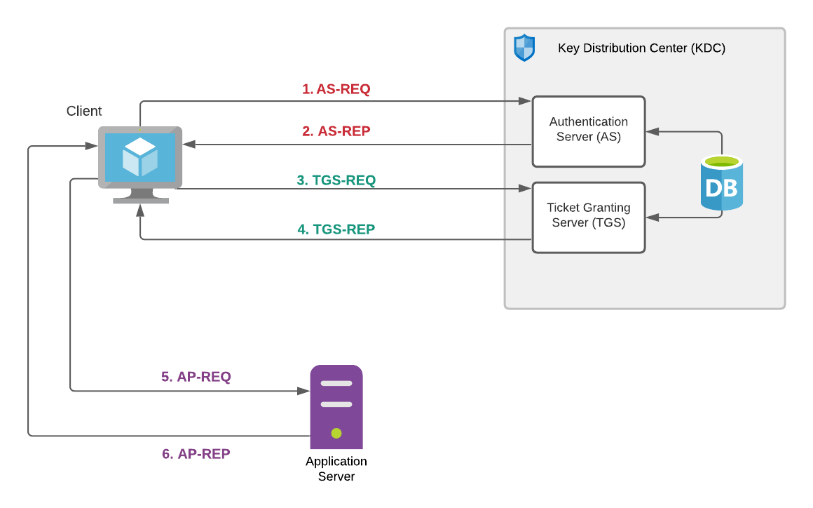

# Kerberos-haters Guide to Zeek Threat Hunting
**NOTE: This guide and repository is being actively updated and will reflect information presented at ZeekWeek 2021. Information is missing but will be added soon. Stay tuned.**


- [Kerberos-haters Guide to Zeek Threat Hunting](#kerberos-haters-guide-to-zeek-threat-hunting)
- [Introduction](#introduction)
- [Kerberos Overview](#kerberos-overview)
  - [Basic Steps](#basic-steps)
  - [Authentication Service (AS)](#authentication-service-as)
  - [Ticket Granting Service (TGS)](#ticket-granting-service-tgs)
  - [Authentication Header (AP)](#authentication-header-ap)
  - [Service Principal Name (SPN)](#service-principal-name-spn)
    - [SPN Format](#spn-format)
- [Where To Start](#where-to-start)
  - [The Logs](#the-logs)
  - [Example Use Cases & Scenarios](#example-use-cases--scenarios)
  - [Critical Kerberos Events](#critical-kerberos-events)
    - [KDC_ERR_PREAUTH_FAILED](#kdc_err_preauth_failed)
    - [KDC_ERR_C_PRINCIPAL_UNKNOWN](#kdc_err_c_principal_unknown)
    - [KDC_ERR_CLIENT_REVOKED](#kdc_err_client_revoked)
    - [KDC_ERR_KEY_EXPIRED](#kdc_err_key_expired)
    - [Weak Ciphers](#weak-ciphers)
- [Noise Makers](#noise-makers)
  - [Common Events](#common-events)
  - [Y2K38 and Weird Timestamps](#y2k38-and-weird-timestamps)
- [Kerberos Event Types](#kerberos-event-types)
- [Kerberos Attacks and Examples](#kerberos-attacks-and-examples)
  - [Kerberoasting](#kerberoasting)
  - [Account Harvesting/Enumerations](#account-harvestingenumerations)

# Introduction
Kerberos is an authentication protocol used extensively in many enterprise environments. It is used to verify the identity of a user to a host. Kerberos V5 is the primary authentication protocol for modern Active Directory deployments and can also be used within Unix and Linux infrastructure. 

Zeek contains a Kerberos V5 protocol analyzer that exposes how the protocol is being used on networks and is an extremely valuable resource for monitoring and threat hunting within these environments. However, experience has shown that the Kerberos log and analyzer are often underutilized resources for detecting threats. 

Kerberos is often misunderstood and can be complicated to implement and maintain. Often new environments use default Kerberos installations with very little tuning or configuration done. 

*NOTE: The queries and examples shown in this guide are using Zeek 4.0+ versions and/or Corelight. The query examples are using Humio (and therefore, Humio query language). However, the Humio query language is straight-forward and can be easily translated to Elastic, Splunk or your log collection system of choice. None of the Zeek fields have been modified from stock.*

*If a query is using a Humio aggregation function, that will be explained so an equivalent aggregation can be done on these other platforms.*


# Kerberos Overview


## Basic Steps
1. Authentication Service - Request (AS-REQ)
2. Authentication Service - Response (AS-REP)
3. Ticket Granting Service - Request (TGS-REQ)
4. Ticket Granting Service - Response (TGS-REP)
5. Application Server/Authentication Header - Request (AP-REQ)
6. Application Server/Authentication Header - Response (AP-REP)

## Authentication Service (AS)
 The client performs the initial authentication (client provided username and password part of `AS-REQ`) and issues Ticket-Granting-Tickets (TGT) for users in `AS-REP` (i.e. a ticket that can be used to request Ticket Granting Service(TGS) tickets). Only the `KRBTGT` service can open and read TGT data. The `AS-REQ` and `AS-REP` portion of the Kerberos protocol is detected and analyzed by Zeek. You can find these requests in the `request_type` field as `AS` in the `kerberos.log` log file. 

## Ticket Granting Service (TGS)
The client now wants to access a Kerberos-enabled resource (such as a file share) on a domain-joined server. The client presents its TGT to the domain controller (KDC) and requests a TGS for a target service (TGS-REQ). If successful, a TGS ticket is enrypted with the target service account password and sent back to the client (`TGS-REP`).

The `TGS-REQ` and `TGS-REP` portion of the Kerberos protocol is detected and analyzed by Zeek. You can find these requests in the `request_type` field as `TGS` in the `kerberos.log` log file. It is this portion of the protocol transaction that you will see Service Principal Name (SPN) data recorded by Zeek (see below). 

## Authentication Header (AP)
The client connects to the target server (e.g. file server) and presents the TGS ticket (`AP-REQ`). If the target server is able to open the ticket using its own service account password, the request is valid and approved. The `AP-REP` portion of the transaction is optional only used in domains where this is configured. 

These messages contain authentication information that should be part of the first message in the authentication transaction to a application server or other Kerberos-enabled service. In Zeek, you will *not see these events recorded* by default since all of the interesting information in these tickets is encrypted. Events are available in Zeek to use, but additional scripting would be required to expose AP event data.  

Another important note: Unless Privilege Attribute Certificate (PAC) validation is enabled in the domain (beyond the scope of this document), the target service will accept the TGS ticket from the client without any additional validation with the domain controller or KDC. This is a source of weakness for attacks such as Kerberoasting. **Zeek does not detect or record PAC validation events.**

## Service Principal Name (SPN)
A Service Principal Name (SPN) is used extensively in Kerberos environments to allow clients to uniquely identify instances of services for a given target computer or application service. An SPN always includes the hostname of the target computer on which the service is being offered as well as a Service Class. 

SPNs in Zeek are recorded in the `service` field of the `kerberos.log` and are a great source of information for monitoring and hunting down all Kerberos-enabled services in your environment, who is using these services and how. In Windows and Active Directory environments, Kerberos-enabled services are plentiful and Kerberos is the default authentication protocol in AD environments. 

### SPN Format
Format is: `serviceclass/host:port servicename`

In the SPN, the `serviceclass` and `host` fields are mandatory. 

| Field | Description |
| ----- | ----- |
| serviceclass | String that identifies the general class of a service. General services camples include `CIFS`, `HTTP`, `LDAP`, `MSSQLSvc`, `TERMSRV` etc. |
| host | The hostname of the target computer running the Kerberos-enabled service. You will either see these as fully-qualified domain names or NetBIOS names (which are not always unique in a domain). |
| port | This field is optional. Shows the TCP or UDP port of the service. You will often see a port provided if multiple instances of the service are running. In general, you will not see the port since services are running on a default port. |
| servicename | This field is optional. IN large environments, it's often the name of the domain (e.g. mydomain.school.edu). It other cases, it might be the DNS name of an SRV or MX record. 

A comprehensive lists of known Active Directory SPNs can be found at [https://adsecurity.org/?page_id=183](https://adsecurity.org/?page_id=183) and will not be documented here. 

More information on SPNs (including registering and editing) can be found at [https://social.technet.microsoft.com/wiki/contents/articles/717.service-principal-names-spn-setspn-syntax.aspx](https://social.technet.microsoft.com/wiki/contents/articles/717.service-principal-names-spn-setspn-syntax.aspx)

# Where To Start
NOTE: As a reminder, the query examples used in this guide use Humio query syntax. However, the queries are simple and should be easy to convery to your logging tool of choice. 

## The Logs

The two request types that you will want to focus on are the `AS` and `TGS` Kerberos requests. 

```
#path=kerberos request_type=AS
#path=kerberos request_type=TGS
```

There are a few key fields in the `kerberos.log` you will want to pay special attention to:

* `error_msg` : The Kerberos error message detected in the protocol (if `success=false`). Reference Kerberos Event Types in this document for a list of those error messages. 
* `cipher` : The encryption cipher used to encrypt the kerberos ticket payloads. Weak ciphers can be easy targets for several Kerberos attacks. Recorded when `success=true` for TGS events. 
* `client` : Also known as *User Principal Name* or the *username* of the requestor. This could either be the account in your Active Directory or some other backend store, such as LDAP. Recorded in both AS and TGS events. 
* `service` : This is the *Service Principal Name (SPN)*. SPNs are identifiers used for accessing services using the service tickets provided by the TGS. SPNs have a particular syntax and are excellent sources of threat hunting information for determining what Kerberos-enabled services are being used on your network and how. Recorded in TGS events. 

## Example Use Cases & Scenarios
| AS Events | TGS Events | 
| ---- | ---- |
| Detected Kerberos Realms<br />Detected KDCs in the environment<br />Bad Passwords / Expired Passwords<br />Unknown Accounts<br />Locked Out / Revoked Accounts<br />Hosts with large amount of UPN success events<br />Hosts with large amounts of UPN failure events<br />Account Enumerations<br />Bruteforcing<br />* High Value Target (HVT) account mapping | Inventory all Service<br />Classes and Hosts<br />Detect legacy and outdated clients<br />Identify Operating Systems<br />Excessive successful TGS requests for large amount of SPNs<br />Excessive failed TGS requests for large amount of SPNs<br />Kerberoasting / TGS SPN Enumeration<br />Weak ciphers: rc4-hmac & rc4-hmac-emp<br />Unusual ticket expirations<br />* High Value Target (HVT) account mapping | 

## Critical Kerberos Events
### KDC_ERR_PREAUTH_FAILED
Related Events: `PREAUTH_FAILED`

Windows Event IDs: `4771`

User principal exists but an invalid password was provided

Recommendations:

Monitor for excessive failures and watch Zeek `client` and `service` fields

* Multiple client attempts
* Single client attempts
* Account enumerations (e.g. pattern of KDC_ERR_C_PRINCIPAL_UNKNOWN and KDC_ERR_PREAUTH_FAILED together)

### KDC_ERR_C_PRINCIPAL_UNKNOWN
Related Events: `CLIENT_NOT_FOUND`

Windows Event IDs: `4768`

Account/client principal not found in database

Recommendation:

Monitor for excessive unknown events

* Large unknown failures, multiple clients with subsequent KDC_ERR_PREAUTH_REQUIRED
* Account enumerations
* Correlate attacks with KDC_ERR_PREAUTH_FAILED


### KDC_ERR_CLIENT_REVOKED
Related Events: `LOCKED OUT`, `CLIENT_REVOKED`
Windows Event IDs: `4768`, `4769`, `4771`

Client credentials have been revoked (disabled, expired, locked out)

Recommendations:

Monitor for excessive or sudden revocations:

* Account DoS
* Bruteforcing
* Misconfigured clients or service accounts
* Runaway scripts and jobs
* Logins taking place outside of logon hours. This error is returned by the KDC in AD environments when `LogonHours` is configured. 

### KDC_ERR_KEY_EXPIRED
Related Events: N/A

Windows Event IDs: `4768`, `4769`

Client password has expired

Monitor for attempts to use expired credentials

* Misconfigurations
* Service accounts
* Expirations with subsequent, unexpected successes
* Vendor accounts or individuals who have left the organization

### Weak Ciphers
Windows Event IDs: `4769`, `4770`

Various Kerberos attacks take advantage of weaknesses with tickets encrypted with weak ciphers. In particular, the "Kerberoasting" attack involves using a compromised account in the organization to extract service account credentials in the environment without sending any packets to the target service. Service account credentials can be cracked offline by requesting a Kerberos Ticket Granting Service (TGS) ticket for the SPNs registered in the environment. If these tickets are encrypted with weak ciphers and the service account password is weak, offline cracking is possible. 

Important points:

* Tickets can be cracked offline without anyone knowing
* Any user authenticated to AD can query for all SPNs in the environment
* Enumeration allows identification of all service accounts supporting and using Kerberos for authentication
* KDC does not track whether the user actually connects to a resource after the TGS has been requested
* AES 128 & 256 encryption became default in Windows Server 2008 and Vista, meaning any modern OS will be encrypting with AES. RC4 and DES requests should be the exception, and sometimes must remain enabled for a application service on a legacy platform not supporting AES.
* Inter-forest Kerberos tickets also use RC4 unless configured to enforce AES. Check your forest trust configurations. 

Recommendations:

* Look in Zeek for TGS requests using weak ciphers: [`rc4-hmac, rc4-hmac-emp, des-cbc-crc, des-cbc-md5`]
* Pay attention to the `service` field in the TGS request. This will provide the SPN of the application service. 
* Ensure service account passwords are longer than 25 characters

Sample Query (Humio)

```
#path=kerberos request_type=TGS success=true | cipher =~ in(values=["rc4-hmac", "rc4-hmac-emp", "des-cbc-crc", "des-cbc-md5"])
```

# Noise Makers
## Common Events
These are Kerberos error events that you may encounter, especially in large environments.

| Error | Description
| ---- | ---- |
| KRB_ERR_PREAUTH_REQUIRED | Ignore<br />Sometimes can cause issues with legacy platforms<br />Normal part of protocol |
| KRB_AP_ERR_TKT_EXPIRED | Ignore<br />Ticket renewal is automatic and purely informational |
| KRB_ERR_RESPONSE_TOO_BIG | Ignore<br />Protocol change from UDP to TCP (normal)<br />Common in Windows Environments |
| KDC_ERR_BADOPTION | KDC cannot accomodate requested options<br />Unless you are troubleshooting a delegation problem, ignore this error |
| KRC_ERR_NEVER_VALID or KRB_AP_ERR_SKEW | Kerberos is time sensitive<br />Helpful for troubleshooting<br />You may have time sync problems in your environment |
| KDC_ERR_ETYPE_NOSUPP | Encryption type requested is not supported<br />Useful for hunting down old devices requesting DES<br />AES requests but domain function level is not 2008+<br />Linux/Unix systems where single algorithm is configured in `krb5.conf`<br />Helpful for troubleshooting |
| KDC_ERR_S_PRINCIPAL_UNKNOWN | Missing or duplicate SPNs registered in AD<br />Incorrect server names or DNS suffixes used by the client<br />Using non-FQDN server names that need to be resolved across AD forests<br />Investigate the use of server names by the client. Often a client or server misconfiguration<br /><br />More info: [Kerberos Event Logging](https://docs.microsoft.com/en-us/troubleshoot/windows-server/identity/enable-kerberos-event-logging)<br />*"An event log 3 about a Kerberos error that has the error code 0x7 KDC_ERR_S_PRINCIPAL_UNKNOWN for Server Name cifs/\<IP address\> will be logged when a share access is made against a server IP address and no server name. If this error is logged, the Windows client automatically tries to fail back to NTLM authentication for the user account. If this operation works, receive no error."* |
| KRB_AP_ERR_MODIFIED | Logged when an SPN is set on an incorrect account, not matching the account the server is running with<br />Could also mean password between KDC issuing the ticket and the server hosting the service is out-of-sync.<br />Check whether SPN is set correctly on KDC<br />Could be related to KDC_ERR_S_PRINCIPAL_UNKNOWN | 

Additional notes about some of the above errors can be found at [https://docs.microsoft.com/en-us/troubleshoot/windows-server/identity/enable-kerberos-event-logging](https://docs.microsoft.com/en-us/troubleshoot/windows-server/identity/enable-kerberos-event-logging)


## Y2K38 and Weird Timestamps
If you're not familiar with the Y2K38 problem, refer to this [Wikipedia article](https://en.wikipedia.org/wiki/Year_2038_problem)

On some platforms, there is a bug in the Kerberos library implementation in which clients will request TGS tickets for the maxiumum allowable lifetime until the KDC responds with a valid `till`. In your logs (and especially in large enviornments), you will see a bizarre timestamp `2037-09-13T02:48:05.000000Z`. 

This timestamp is often set by clients for TGS requests with a date set far into the future until the KDC completes a TGS-REP with a real expiration time. This date is close to the Y2K38 time limit, which is the limit for 32-bit signed integers still used by operating systems and library implementations for time structures today. The KRB5 implementation in many modern products is still using a 32-bit date structure for Kerberos tickets. 

Here is an example kerberos.log event:

```
{
  "_path": "kerberos",
  "_system_name": “zeek02",
  "_write_ts": "2021-10-12T01:29:17.119252Z",
  "cipher": "aes256-cts-hmac-sha1-96",
  "client": “joey/domain.local",
  "forwardable": true,
  "id.orig_h": "10.25.49.89",
  "id.orig_p": 64514,
  "id.resp_h": "10.11.16.38",
  "id.resp_p": 88,
  "renewable": true,
  "request_type": "TGS",
  "service": "LDAP/AD3.domain.local/domain.local",
  "success": true,
  "till": "2037-09-13T02:48:05.000000Z", <--------- Weird timestamp??
  "ts": "2021-10-12T01:29:17.119252Z",
  "uid": "Cqsvog4izYWRZlrZch"
}
```

The exact timestamp of `2037-09-13T02:48:05.000000Z` (or close to it) is easy to identify and filter in logs. In general, `till` with the exact above timestamp are safe to ignore and are not indicative of something nefarious. I have often ignored this timestamp in my logs. Be careful however to not ignore other `till` timestamps with long lifetimes as they can be indicators of an attack (e.g. a ticket lifetime that is beyond your domains configuration standards, such as 10 years). 

A great discussion on this topic can be found at [https://github.com/zeek/zeek/issues/1112](https://github.com/zeek/zeek/issues/1112)

Additional discussion on this topic can be found in a session presented at DebConf'17 at [https://lwn.net/Articles/732794/](https://lwn.net/Articles/732794/)

# Kerberos Event Types
This table is provided for reference and similar tables can be found in the links below. This table was included to allow commenting in how these events relate to Zeek monitoring. Briefly, the following fields are:

* Code: This code is often used for determining specific error events in Windows event logs. This code is not exposed in Zeek logs. 
* Name: The Kerberos error event string. This string is recorded in Zeek `kerberos.log` in the `error_msg` field. 
* Description: A brief description of the error (sources from Microsoft article)
* Notes: Notes on the error and additional information as it relates to Zeek or log queries. 

[4768(S, F): A Kerberos authentication ticket (TGT) was requested.](https://docs.microsoft.com/en-us/windows/security/threat-protection/auditing/event-4768)

[Kerberos V5 Library Error Codes (MIT)](http://web.mit.edu/kerberos/krb5-1.5/krb5-1.5.4/doc/krb5-admin/Kerberos-V5-Library-Error-Codes.html)

[Kerberos Library Error Codes (Heimdal)](https://github.com/heimdal/heimdal/blob/master/lib/krb5/krb5_err.et)

| Code | Name | Description | Notes |
| --- | --- | --- | --- |
| 0x0 | KDC_ERR_NONE | No error | No errors were found. |
| 0x1 | KDC_ERR_NAME_EXP | Client's entry in KDC database has expired | `ERROR_ACCOUNT_EXPIRED` set on account (AD) or often `accountExpires` attribute in LDAP.  |
| 0x2 | KDC_ERR_SERVICE_EXP | Server's entry in KDC database has expired | See above, but the same for a server account. |
| 0x3 | KDC_ERR_BAD_PVNO | Requested Kerberos version number not supported | No information. |
| 0x4 | KDC_ERR_C_OLD_MAST_KVNO | Client's key encrypted in old master key | No information. |
| 0x5 | KDC_ERR_S_OLD_MAST_KVNO | Server's key encrypted in old master key | No information. |
| 0x6 | KDC_ERR_C_PRINCIPAL_UNKNOWN | Client not found in Kerberos database | The username doesn’t exist in the Kerberos database. This is a great error code to monitor for account enumeration bruteforcing in the environment. A large number of these errors with unique client principals (usernames) over brief periods of time could be an attack<br /><br />Shows up as both `AS` and `TGS` requests in Zeek.<br /><br />Zeek:<br />`request_type=[AS,TGS],success=false,error_msg=KDC_ERR_C_PRINCIPAL_UNKNOWN`<br /><br />Humio:<br />`#repo=zeek #path=kerberos error_msg="KDC_ERR_C_PRINCIPAL_UNKNOWN" \|groupby(request_type)` |
| 0x7 | KDC_ERR_S_PRINCIPAL_UNKNOWN | Server not found in Kerberos database | This error can occur if the domain controller cannot find the server’s name in Active Directory. This error is similar to KDC_ERR_C_PRINCIPAL_UNKNOWN except that it occurs when the server name cannot be found.<br /><br />All requests are `TGS`<br /><br />Zeek: <br />`request_type=TGS, success=false, error_msg=KDC_ERR_S_PRINCIPAL_UNKNOWN`<br /><br />Humio:<br />`#repo=zeek #path=kerberos error_msg="KDC_ERR_S_PRINCIPAL_UNKNOWN" \|groupby(request_type)`|
| 0x8 | KDC_ERR_PRINCIPAL_NOT_UNIQUE | Multiple principal entries in KDC database | This error occurs if duplicate principal names exist. Unique principal names are crucial for ensuring mutual authentication. Thus, duplicate principal names are strictly forbidden, even across multiple realms. Without unique principal names, the client has no way of ensuring that the server it is communicating with is the correct one. |
| 0x9 | KDC_ERR_NULL_KEY | The client or server has a null key (master key) | No master key was found for client or server. Usually it means that administrator should reset the password on the account. |
| 0xA | KDC_ERR_CANNOT_POSTDATE | Ticket (TGT) not eligible for postdating | This error can occur if a client requests postdating of a Kerberos ticket. Postdating is the act of requesting that a ticket’s start time be set into the future. It also can occur if there is a time difference between the client and the KDC. |
| 0xB | KDC_ERR_NEVER_VALID | Requested start time is later than end time | There is a time difference between the KDC and the client.<br /><br />Shows as both `AS` and `TGS` requests in Zeek.<br /><br />Zeek:<br /><br />Humio:<br />`#repo=zeek #path=kerberos error_msg="KDC_ERR_NEVER_VALID" \|groupby(request_type)`<br /><br />`#repo=zeek #path=kerberos error_msg="KDC_ERR_NEVER_VALID" \|groupby([id.orig_h, request_type, service, id.resp_h]) \|rdns(id.orig_h, as=orig_dns) \|rdns(id.resp_h, as=resp_dns` |
| 0xC | KDC_ERR_POLICY | Requested start time is later than end time | This error is usually the result of logon restrictions in place on a user’s account. For example workstation restriction, smart card authentication requirement or logon time restriction. |
| 0xD | KDC_ERR_BADOPTION | KDC cannot accommodate requested option | Impending expiration of a TGT. The SPN to which the client is attempting to delegate credentials is not in its Allowed-to-delegate-to list.<br /><br />Shows up as `TGS` requests in Zeek.<br /><br />Zeek:<br />`request_type=TGS, success=false, error_msg=KDC_ERR_BADOPTION`<br /><br />Humio:<br />`#repo=zeek #path=kerberos error_msg="KDC_ERR_BADOPTION" \|groupby(request_type)` |
| 0xE | KDC_ERR_ETYPE_NOTSUPP | KDC has no support for encryption type | In general, this error occurs when the KDC or a client receives a packet that it cannot decrypt. |
| 0xF | KDC_ERR_SUMTYPE_NOSUPP | KDC has no support for checksum type | The KDC, server, or client receives a packet for which it does not have a key of the appropriate encryption type. The result is that the computer is unable to decrypt the ticket. |
| 0x10 | KDC_ERR_PADATA_TYPE_NOSUPP | KDC has no support for PADATA type (pre-authentication data) | Smart card logon is being attempted and the proper certificate cannot be located. This can happen because the wrong certification authority (CA) is being queried or the proper CA cannot be contacted. It can also happen when a domain controller doesn’t have a certificate installed for smart cards (Domain Controller or Domain Controller Authentication templates). This error code cannot occur in event “4768. A Kerberos authentication ticket (TGT) was requested”. It occurs in “4771. Kerberos pre-authentication failed” event. |
| 0x11 | KDC_ERR_TRTYPE_NO_SUPP | KDC has no support for transited type | No information. |
| 0x12 | KDC_ERR_CLIENT_REVOKED | Client’s credentials have been revoked | This might be because of an explicit disabling or because of other restrictions in place on the account. For example: account disabled, expired, or locked out.<br /><br />Shows up as both `AS` and `TGS` requests in Zeek.<br /><br />Zeek:<br /><br />Humio: |
| 0x13 | KDC_ERR_SERVICE_REVOKED | Credentials for server have been revoked | No information. |
| 0x14 | KDC_ERR_TGT_REVOKED | TGT has been revoked | Since the remote KDC may change its PKCROSS key while there are PKCROSS tickets still active, it SHOULD cache the old PKCROSS keys until the last issued PKCROSS ticket expires. Otherwise, the remote KDC will respond to a client with a KRB-ERROR message of type KDC_ERR_TGT_REVOKED. See RFC1510 for more details. |
| 0x15 | KDC_ERR_CLIENT_NOTYET | Client not yet valid—try again later | No information. |
| 0x16 | KDC_ERR_SERVICE_NOTYET | Server not yet valid—try again later | No information. |
| 0x17 | KDC_ERR_KEY_EXPIRED | Password has expired—change password to reset | The user’s password has expired. This error code cannot occur in event “4768. A Kerberos authentication ticket (TGT) was requested”. It occurs in “4771. Kerberos pre-authentication failed” event.<br /><br />Shows up as `AS` requests in Zeek<br /><br />Zeek:<br />`request_type=AS, success=false, error_msg=KDC_ERR_KEY_EXPIRED`<br /><br />Humio:<br />`#repo=zeek #path=kerberos error_msg="KDC_ERR_KEY_EXPIRED" \|groupby(client)`|
| 0x18 | KDC_ERR_PREAUTH_FAILED | Pre-authentication information was invalid | The wrong password was provided. This error code cannot occur in event “4768. A Kerberos authentication ticket (TGT) was requested”. It occurs in “4771. Kerberos pre-authentication failed” event.<br /><br />Zeek:<br />`request_type=AS, success=false, error_msg=KDC_ERR_PREAUTH_FAILED`<br /><br />Humio:<br />`#repo=zeek #path=kerberos error_msg="KDC_ERR_PREAUTH_FAILED" \|groupby(request_type)` |
| 0x19 | KDC_ERR_PREAUTH_REQUIRED | Additional pre-authentication required | *This error often occurs in UNIX interoperability scenarios. MIT-Kerberos clients do not request pre-authentication when they send a KRB_AS_REQ message. If pre-authentication is required (the default), Windows systems will send this error. Most MIT-Kerberos clients will respond to this error by giving the pre-authentication, in which case the error can be ignored, but some clients might not respond in this way.*<br /><br />Zeek: <br />`request_type=AS, success=false, error_msg=KDC_ERR_PREAUTH_REQUIRED`<br /><br />Humio:<br /> `#repo=zeek #path=kerberos \| "error_msg"="KDC_ERR_PREAUTH_REQUIRED" \| groupBy([id.orig_h, id.resp_h, request_type, client, service])\|rdns(id.orig_h, as=orig_dns)\|rdns(id.resp_h, as=resp_dns)\|table([id.orig_h, orig_dns, id.resp_h, resp_dns, request_type, client, service, _count], sortby=_count` |
| 0x1A | KDC_ERR_SERVER_NOMATCH | KDC does not know about the requested server | No information. |
| 0x1D | KDC_ERR_SVC_UNAVAILABLE | KDC is unavailable | No information. |
| 0x1F | KRB_AP_ERR_BAD_INTEGRITY | Integrity check on decrypted field failed | The authenticator was encrypted with something other than the session key. The result is that the client cannot decrypt the resulting message. The modification of the message could be the result of an attack or it could be because of network noise. |
| 0x20 | KRB_AP_ERR_TKT_EXPIRED | The ticket has expired | The smaller the value for the “Maximum lifetime for user ticket” Kerberos policy setting, the more likely it is that this error will occur. Because ticket renewal is automatic, you should not have to do anything if you get this message. |
| 0x21 | KRB_AP_ERR_TKT_NYV | The ticket is not yet valid | The ticket presented to the server is not yet valid (in relationship to the server time). The most probable cause is that the clocks on the KDC and the client are not synchronized. If cross-realm Kerberos authentication is being attempted, then you should verify time synchronization between the KDC in the target realm and the KDC in the client realm, as well.<br /><br />Not seen in Zeek environment. Unknown.<br /><br />Zeek: Unknown<br /><br />Humio:<br />`#repo=zeek #path=kerberos error_msg="KRB_AP_ERR_TKT_NYV"`|
| 0x22 | KRB_AP_ERR_REPEAT | The request is a replay | This error indicates that a specific authenticator showed up twice — the KDC has detected that this session ticket duplicates one that it has already received. |
| 0x23 | KRB_AP_ERR_NOT_US | The ticket is not for us | The server has received a ticket that was meant for a different realm. |
| 0x24 | KRB_AP_ERR_BADMATCH | The ticket and authenticator do not match | The KRB_TGS_REQ is being sent to the wrong KDC. There is an account mismatch during protocol transition. |
| 0x25 | KRB_AP_ERR_SKEW | The clock skew is too great | This error is logged if a client computer sends a timestamp whose value differs from that of the server’s timestamp by more than the number of minutes found in the “Maximum tolerance for computer clock synchronization” setting in Kerberos policy.<br /><br />Shows up as both `AS` and `TGS` requests in Zeek.<br /><br />Zeek:<br />`request_type=[AS,TGS], success=false, error_msg=KRB_AP_ERR_SKEW`<br /><br />Humio:<br />`#repo=zeek #path=kerberos error_msg="KRB_AP_ERR_SKEW" \| groupBy("request_type")`  |
| 0x26 | KRB_AP_ERR_BADADDR | Network address in network layer header doesn't match address inside ticket | Session tickets MAY include the addresses from which they are valid. This error can occur if the address of the computer sending the ticket is different from the valid address in the ticket. A possible cause of this could be an Internet Protocol (IP) address change. Another possible cause is when a ticket is passed through a proxy server or NAT. The client is unaware of the address scheme used by the proxy server, so unless the program caused the client to request a proxy server ticket with the proxy server's source address, the ticket could be invalid. |
| 0x27 | KRB_AP_ERR_BADVERSION | Protocol version numbers don't match (PVNO) | When an application receives a KRB_SAFE message, it verifies it. If any error occurs, an error code is reported for use by the application. The message is first checked by verifying that the protocol version and type fields match the current version and KRB_SAFE, respectively. A mismatch generates a KRB_AP_ERR_BADVERSION. See RFC4120 for more details. |
| 0x28 | KRB_AP_ERR_MSG_TYPE | Message type is unsupported | This message is generated when target server finds that message format is wrong. This applies to KRB_AP_REQ, KRB_SAFE, KRB_PRIV and KRB_CRED messages. This error also generated if use of UDP protocol is being attempted with User-to-User authentication. |
| 0x29 | KRB_AP_ERR_MODIFIED | Message stream modified and checksum didn't match | The authentication data was encrypted with the wrong key for the intended server. The authentication data was modified in transit by a hardware or software error, or by an attacker. The client sent the authentication data to the wrong server because incorrect DNS data caused the client to send the request to the wrong server. The client sent the authentication data to the wrong server because DNS data was out-of-date on the client. <br /><br />Request type is usually absent in Zeek.<br /><br />Zeek:<br />`success=false, error_msg=KRB_AP_ERR_MODIFIED`<br /><br />Humio:<br />`#repo=zeek #path=kerberos error_msg="KRB_AP_ERR_MODIFIED" !request_type="*"` |
| 0x2A | KRB_AP_ERR_BADORDER | Message out of order (possible tampering) | This event generates for KRB_SAFE and KRB_PRIV messages if an incorrect sequence number is included, or if a sequence number is expected but not present. See RFC4120 for more details. |
| 0x2C | KRB_AP_ERR_BADKEYVER | Specified version of key is not available | This error might be generated on server side during receipt of invalid KRB_AP_REQ message. If the key version indicated by the Ticket in the KRB_AP_REQ is not one the server can use (e.g., it indicates an old key, and the server no longer possesses a copy of the old key), the KRB_AP_ERR_BADKEYVER error is returned. |
| 0x2D | KRB_AP_ERR_NOKEY | Service key not available | This error might be generated on server side during receipt of invalid KRB_AP_REQ message. Because it is possible for the server to be registered in multiple realms, with different keys in each, the realm field in the unencrypted portion of the ticket in the KRB_AP_REQ is used to specify which secret key the server should use to decrypt that ticket. The KRB_AP_ERR_NOKEY error code is returned if the server doesn't have the proper key to decipher the ticket. |
| 0x2E | KRB_AP_ERR_MUT_FAIL | Mutual authentication failed | No information. |
| 0x2F | KRB_AP_ERR_BADDIRECTION | Incorrect message direction | No information. |
| 0x30 | KRB_AP_ERR_METHOD | Alternative authentication method required | According RFC4120 this error message is obsolete. |
| 0x31 | KRB_AP_ERR_BADSEQ | Incorrect sequence number in message | No information. |
| 0x32 | KRB_AP_ERR_INAPP_CKSUM | Inappropriate type of checksum in message (checksum may be unsupported) | When KDC receives KRB_TGS_REQ message it decrypts it, and after that, the user-supplied checksum in the Authenticator MUST be verified against the contents of the request. The message MUST be rejected either if the checksums do not match (with an error code of KRB_AP_ERR_MODIFIED) or if the checksum is not collision-proof (with an error code of KRB_AP_ERR_INAPP_CKSUM). |
| 0x33 | KRB_AP_PATH_NOT_ACCEPTED | Desired path is unreachable | No information. |
| 0x34 | KRB_ERR_RESPONSE_TOO_BIG | Too much data | The size of a ticket is too large to be transmitted reliably via UDP. In a Windows environment, this message is purely informational. A computer running a Windows operating system will automatically try TCP if UDP fails.<br /><br />Shows up as `AS` requests in Zeek.<br /><br /> |
| 0x3C | KRB_ERR_GENERIC | Generic error | Group membership has overloaded the PAC. Multiple recent password changes have not propagated. Crypto subsystem error caused by running out of memory. SPN too long. SPN has too many parts. |
| 0x3D | KRB_ERR_FIELD_TOOLONG | Field is too long for this implementation | Each request (KRB_KDC_REQ) and response (KRB_KDC_REP or KRB_ERROR) sent over the TCP stream is preceded by the length of the request as 4 octets in network byte order. The high bit of the length is reserved for future expansion and MUST currently be set to zero. If a KDC that does not understand how to interpret a set high bit of the length encoding receives a request with the high order bit of the length set, it MUST return a KRB-ERROR message with the error KRB_ERR_FIELD_TOOLONG and MUST close the TCP stream.<br /><br />Often contain no `request_type` in Zeek.<br /><br />Zeek:<br />`success=false, error_msg=KRB_ERR_FIELD_TOOLONG`<br /><br />Humio:<br />`#repo=zeek #path=kerberos error_msg="KRB_ERR_FIELD_TOOLONG"`|
| 0x3E | KDC_ERR_CLIENT_NOT_TRUSTED | The client trust failed or is not implemented | This typically happens when user’s smart-card certificate is revoked or the root Certification Authority that issued the smart card certificate (in a chain) is not trusted by the domain controller. |
| 0x3F | KDC_ERR_KDC_NOT_TRUSTED | The KDC server trust failed or could not be verified | The trustedCertifiers field contains a list of certification authorities trusted by the client, in the case that the client does not possess the KDC's public key certificate. If the KDC has no certificate signed by any of the trustedCertifiers, then it returns an error of type KDC_ERR_KDC_NOT_TRUSTED. See RFC1510 for more details. |
| 0x40 | KDC_ERR_INVALID_SIG | The signature is invalid | This error is related to PKINIT. If a PKI trust relationship exists, the KDC then verifies the client's signature on AuthPack (TGT request signature). If that fails, the KDC returns an error message of type KDC_ERR_INVALID_SIG. |
| 0x41 | KDC_ERR_KEY_TOO_WEAK | A higher encryption level is needed | If the clientPublicValue field is filled in, indicating that the client wishes to use Diffie-Hellman key agreement, then the KDC checks to see that the parameters satisfy its policy. If they do not (e.g., the prime size is insufficient for the expected encryption type), then the KDC sends back an error message of type KDC_ERR_KEY_TOO_WEAK. |
| 0x42 | KRB_AP_ERR_USER_TO_USER_REQUIRED | User-to-user authorization is required | In the case that the client application doesn't know that a service requires user-to-user authentication, and requests and receives a conventional KRB_AP_REP, the client will send the KRB_AP_REP request, and the server will respond with a KRB_ERROR token as described in RFC1964, with a msg-type of KRB_AP_ERR_USER_TO_USER_REQUIRED. |
| 0x43 | KRB_AP_ERR_NO_TGT | No TGT was presented or available | In user-to-user authentication if the service does not possess a ticket granting ticket, it should return the error KRB_AP_ERR_NO_TGT. |
| 0x44 | KDC_ERR_WRONG_REALM | Incorrect domain or principal | Although this error rarely occurs, it occurs when a client presents a cross-realm TGT to a realm other than the one specified in the TGT. Typically, this results from incorrectly configured DNS. |
| XXX | CLIENT_NOT_FOUND | TBD | TBD
| XXX | LOOKING_UP_SERVER | TBD | TBD
| XXX | PREAUTH_FAILED | TBD | TBD
| XXX | LOCKED_OUT | TBD | TBD
| 0x80000001 | KDC_ERR_MORE_DATA | More data is available | Windows-specific Response<br /><br />Not enumerated by Zeek |
| 0x80000002 | KDC_ERR_NOT_RUNNING | The Kerberos service is not running | Windows-specific response<br /><br />Not enumerated by Zeek |


# Kerberos Attacks and Examples
## Kerberoasting

Kerberoasting attack has been detected using valid domain credentials. Adversaries possessing a valid Kerberos ticket-granting ticket (TGT) may request one or more Kerberos ticket-granting service (TGS) service tickets for any SPN from a domain controller (DC). Portions of these tickets may be encrypted with a weak RC4 algorithm, meaning the hash of the service account associated with the SPN is used as the private key and is thus vulnerable to offline Brute Force attacks that may expose plaintext credentials. Some text sourced from [T1208 - https://attack.mitre.org/techniques/T1208/](https://attack.mitre.org/techniques/T1558/003/)

```
#path=kerberos success=true request_type=TGS !service=/\$/ !client=/\$/ !service=/^krbtgt/
|cipher =~ in(values=["rc4-hmac", "rc4-hmac-emp"])
|splitString(service, by="\/", index=0, as=spn_class)
|groupby(field=[id.orig_h], function=session(maxpause=15m, function=
	[count(service, distinct=true, as=unique_spns),
	count(spn_class, distinct=true, as=spn_classes),
    collect([spn_class], multival=true),
	collect([client]),
	max(@timestamp, as=lts), min(@timestamp, as=fts)]))
|duration := formatTime("%H:%M:%S", field=_duration, locale=en_US, timezone=Z)
|duration_s := formatTime("%s", field=_duration, locale=en_US, timezone=Z)
|first := formatTime("%Y-%m-%d %H:%M:%S", field=fts, locale=en_US, timezone=Z)
|last := formatTime("%Y-%m-%d %H:%M:%S", field=lts, locale=en_US, timezone=Z)
|duration_s <= 300
|unique_spns >= 30
|spn_classes >= 10
|rdns(id.orig_h, as="hostname")
|table([first, last, id.orig_h, hostname, duration, client, unique_spns, spn_classes, spn_class], sortby=unique_spns)
```

A great resource for a deeper dive into Kerberoasting activity can be found at [https://adsecurity.org/?p=3458](https://adsecurity.org/?p=3458)

## Account Harvesting/Enumerations
Detects when a Kerberos/AD domain user enumeration attack has occurred in a short period of time (more than 100 unique UPN attempts bucketed by 15 minute sessions). These requests are invalid and contain a large number of unknown client principals and client revoked events. Note the detect duration with associated first and last seen timestamps.

```
#path=kerberos request_type success=false !client=/\$/ !error_msg="KDC_ERR_PREAUTH_REQUIRED"
|groupby(field=id.orig_h, function=session(maxpause=15m, function=
	[count(client, distinct=true, as=unique_upns),
	count(error_msg, distinct=true, as=unique_errors),
	collect([error_msg], multival=true), 
	max(@timestamp, as=lts), min(@timestamp, as=fts)]))
|duration := formatTime("%H:%M:%S", field=_duration, locale=en_US, timezone=Z)
|duration_s := formatTime("%s", field=_duration, locale=en_US, timezone=Z)
|first := formatTime("%Y-%m-%d %H:%M:%S", field=fts, locale=en_US, timezone=Z)
|last := formatTime("%Y-%m-%d %H:%M:%S", field=lts, locale=en_US, timezone=Z)
|unique_upns >= 100
|duration_s <= 300
|replace("\s+", with=", ", field=error_msg, as=errors)
|rdns(id.orig_h, as="hostname")
|table([first, last, id.orig_h, hostname, duration, client, unique_upns, unique_errors, errors], sortby=unique_upns)
```

More to come